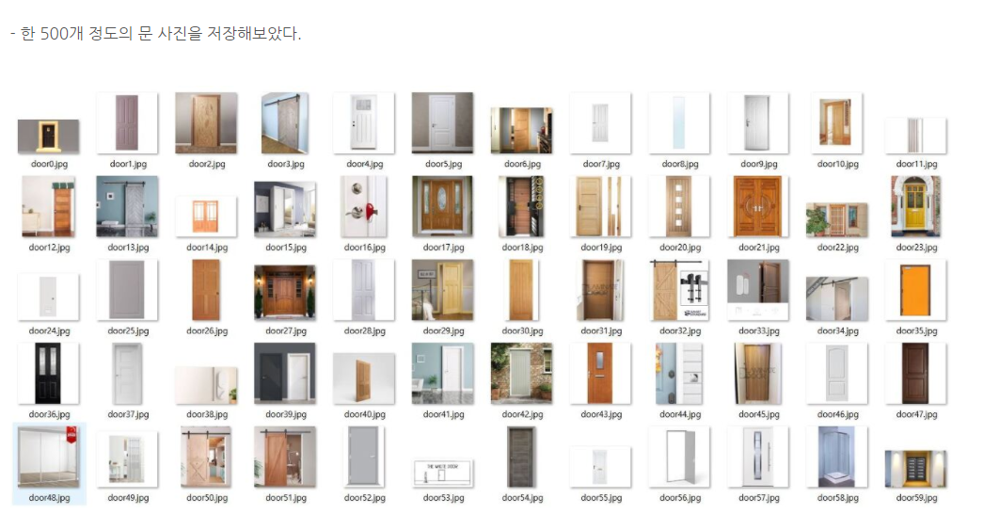
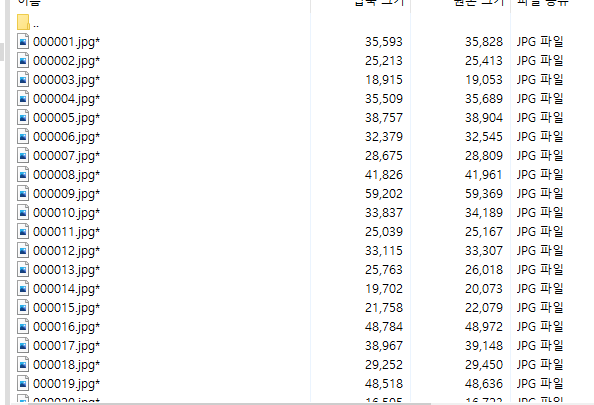

# modeling_develop
오픈소스 프로젝트 모델링(openCV + DL + AI) 공간입니다.

----------------
### 21.11.09 Update
Musinsa C
* 무신사 크롤링 ( 원하는건 크롤링 가능하나 우선 상의만 ) (상의만해도 15만이미지.. 아우터 포함 5만이미지 더할지는 아직 미정)

Pictures폴더:
우선 상의 270개테스트로 올림. 이미지 크기가 엄청 커지면 git으로 못올리는것같음.(몇백 메가이상)
(형식 : 상의n Page n.jpg) //변경가능
TmpDB: 임시적으로 DB로 생각하여 제품들의 정보 저장

TensorTest.py
코드 참조하여 실행해보았음. -> notion 공부 창 블로그 참고(참 친절함)
→ 270개 돌리는데  2분 52초걸렸음.. 이걸 ppt에 적어야하나 고민됨.. →다른 코드의 방법있는가..?

문제점 : 1.만약 사용자의 착샷을 올린다면 ? 전처리가 필요해보임. ..

지민님이 말씀해주신
[참고 페이지](https://deepestdocs.readthedocs.io/en/latest/003_image_processing/0030/)
페이지 참고하여 전처리 공부할 예정

         2. 현재 Imagenet이라는 데이터셋만 훈련된 상태임.

        	fashion MNIST와 사진 이미지 Data를 추가 학습 시켜야 될것같음

    	3. 실행한 코드도 잘 이해를 못한 상황임. 

      (거의 무지성 복붙임.. npy에 대한 개념과 함수사용 숙지 필요해보임)

### 21.11.03 Update

#### 일반 사용할 이미지 데이터셋 확인
* 이미지 파일들이 모여진 폴더(번호로 명명된 파일들) + a(ex. 설명들이 모여있는 폴더)
    
    
    - 만약 이미지에 대한 설명으로 링크를 넣어줄 예정이라면 csv 확장자 파일을 통해 이미지의 번호-인덱스와 일치하는 곳에 링크를 넣는 형식으로도 진행 가능한지 가능성 여부 파악하기.

#### Test Data 수집
* Test 이미지 확보를 위한 방법 2가지 고려.
    1. 일반적인 라이브러리 등에서 구할 수 있는 데이터셋. **In progress**
    이는 github 및 kaggle에서 구하기 가능.
    - DeepFashion2 Data : DeepFashion2 Challenge에 result를 submit해야 사용 가능 -> **submit 완료** (결과 기다려야)
    [참고 페이지](https://github.com/switchablenorms/DeepFashion2)
    - Fashion-Mnist : `fashion_mnist.load_data()'` 이용하여 데이터 부르기 가능.

    2. 후기 데이터셋 (보다 더 정확도 있는 테스트 진행 가능할 것으로 예상) **Not started**
    - 크롤링 진행 예정.
        * 구글에 특정한 제품에 대한 이미지를 입력한 뒤 사진 저장 방법
        * 무신사 페이지 및 제품 내 후기란에 존재하는 이미지 저장 방법 -->보류

#### Train Data Crawling
* Base Code = 무신사 이미지 크롤링
    [참고 페이지](https://10000sukk.tistory.com/3)

#### 이미지 전처리 기법 조사 및 Study
* 참고 페이지
    [참고 페이지](https://deepestdocs.readthedocs.io/en/latest/003_image_processing/0030/)

* Image Augmentation(데이터 변조)
    - Crop(잘라내기), Rotate(회전), Flip(뒤집기), Translate(픽셀밀기), Resize(=Rescale, 크기 수정)
    - Color Modeification(색감을 바꾸는 작업. 색 이탈 등)
    - Noise Addition(처음 가지고 있던 데이터가 완전히 노이즈가 없거나 편향되지 않은 상태는 아니기에, 자칫 잘못하면 성능이 확 나빠질 수 있음)

* Image Preprocessing (CNN이 발전하면서 잘 사용하지는 않지만, 평균을 0으로 맞추는 작업과 데이터 크기를 보정해주는 작업이 필수적)
    - Zero Centering, Scaling (이 과정은 거의 필수)
    - Contrast Normalization (대비 표준화)
    - Whitening(백색화, 각 픽셀드의 상관관계를 거의 없애고 싶을 때 사용)

* Using Method Notation
    [참고 페이지](https://www.mygreatlearning.com/blog/introduction-to-image-pre-processing/)

* 여러가지 구현 형태를 보고 싶다면
    [참고 페이지 1](https://www.kaggle.com/khotijahs1/image-preprocessing-for-cassava-leaf-disease)
    [참고 페이지 2](https://www.kaggle.com/nzhongahtan/simple-preprocessing-techinques-using-minst-data)
    [참고 페이지 3](https://www.kaggle.com/khotijahs1/cv-image-preprocessing)
    - 구현 시 추가적으로 방법을 찾고 싶다면 kaggle을 찾아보는 것이 도움이 될 것 같음.
