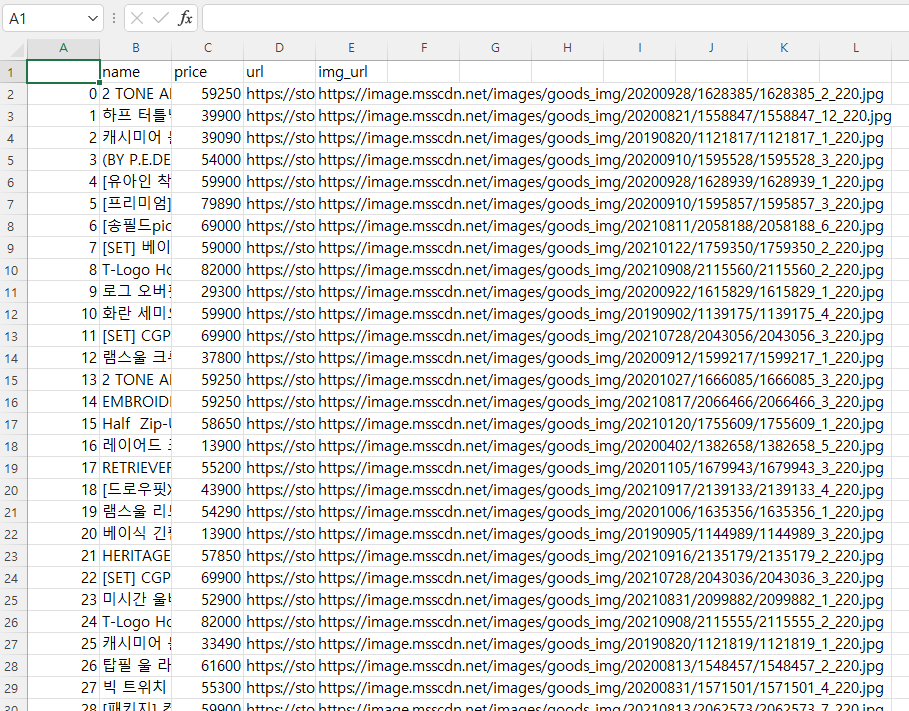
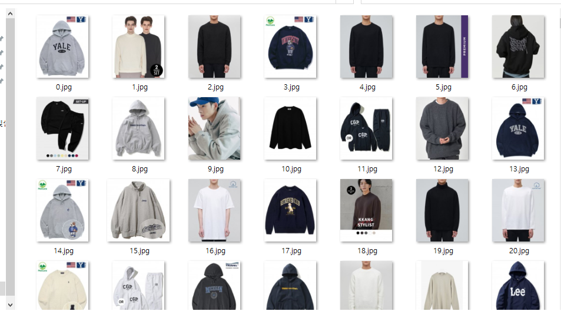

# modeling_develop
오픈소스 프로젝트 모델링(openCV + DL + AI) 공간입니다.

---------------
###21.12.04 Update
#우선 아직 전처리 되지않은 npy파일 드라이브 다운 : https://drive.google.com/drive/my-drive
며칠 내로 전처리 된 npy 파일이 올라오면 다른거 바꿀필요없이 npy 파일만 바꾸면 됨.
우선 연결을 시켜야되니까 올림. 

1. 사용자 사진 -> Top-extract 폴더 안에 main.py 를 실행시켜 크롭
2. 그 크롭된 사진을 Pick_results.py 를 사용하면 비슷한 이미지들의 id 30개 반환
3. 디비에서 그 id에 맞는 이미지 url 을 띄우기.
#현재 디비로 쓰일 csv파일은 train_top50000.csv 파일. (상품 이름이 깨지는 것 같긴 한데, 화면에 띄우기엔 애매하기도 함.
왜냐면 모델명이 주루룩 나오는거라.. 우선 신혜님께 말씀드림.)

- 주의할점 : 시간이 얼마나 걸릴지 모르겠음. 해봐야 알 것 같음
- 코드를 연결하기위해 코드 수정이 필요함. ex) 현재는 id 30개 print지만, 서버에 건네주는 방식

### 21.11.26 Update
###Feature 폴더 : 
이 안에 있는 npy값은 크게 두가지이다.
1.이미지 경로가 들어있는 npy값 (필요한지모르겠음. 잠시 띄우기 위해서 우선 저장함. 사용할 사람마다 달라짐.
현재 저 안에 있는 값은 ErasePic 폴더 안에있는 이미지들인데 이는 너무 커서 보내기 힘듦...) 바꿔서 사용해야함.

2.이미지의 특징들이 들어가있는 npy값. 

 1)현재 (Total_RealLast_Erase_1_2(Notcut).npy) -> 
임시로 상의 4950개를 cut(지우는 전처리)을 하지않고 있는 그대로 특징추출

 2)Total_RealLast_Erase_1_2.npy -> 자른 상태 추출 (자른 상태 보기 위해)

###
Making_NPY.py : npy 파일 만들고
Test_With_Prepared NPY.py로 만들어진 npy를 이용해 비교.

###
Top-extract 폴더 : 
상의 자를 이미지를 image 폴더에 넣고 main.py로 동작함.

필요한 다운로드 파일 :
https://drive.google.com/file/d/1DPydA0FpLYEHaFYDa8_oZAot_Ou5JefK/edit

참조 깃은 노션에 존재

### 21.11.19 Update
###Feature 폴더 : 
의상들의 특징이 저장되어있는 npy들과 이미지 파일들의 위치가 저장되어있는 npy파일이 있다.
이미지 파일의 위치는, 사용자에게 띄워주기 위해 잠시 존재하고 있다. ->회의 필요

####의상 전처리 코드 (입고있는 옷 잘라서 배경 지우기)

 사용법 : python extract.py (이미지명)
-> 이 코드가 적절하다 판단하면 모든 15만개의 파일을 적용시켜 저장 ->회의필요

이에 필요한 h5 파일 링크 : ( 250메가라 바로 push가 되지 않음)
https://drive.google.com/file/d/1l7PUB8uAGRyqvZ0ti0ZACoI2CzJxOVoI/view
 
  1.소요시간 : 상당히 많이걸릴듯..? 15만개를 하려면 -> 우선 200개 해보기,
  2. 문제점 : 이 코드는 좌우를 동시에 보여줘서, 전후를 비교하게해줌. 이미지를 잘라서 저장해야함.
   	  :  그리고 전신샷을 자르려고할때, 하의도 출력이 되는 것 같음.
	:  정확도가 이정도면 준수한 것같지만 경계선이 조금 흐릿함.

	  

문제점: 후드티인데 사진에서 후드가 아니라서 검은색 반팔로 인식을 하는것같다.
긍정적으로 보면 그래도 검은색 긴팔이라고 생각했다는거 정도..?

이 코드를 이용해 사용자가 옷을 입력했을때, 바로 옷만 입은 장면을 추출하고,
 그에따라 저장되어있는 npy 파일(이미 크롤링 된 사진들을 모두 다 자르기) 에서 찾는 방식을 구상중..  

### 21.11.17 Update
=======

#### Train Data 수집 
* 상의 데이터 총 5만개 크롤링 완료 (`MusinsaCrawling_1.2.ipynb` 파일로 진행)
    1. 소요시간 : 3시간 이내
    2. 문제점 : 중복되는 상품 존재(url과 상품명으로 조합했을 때 발견한 건들) 삭제하려고 했으나, 저장된 제품의 사진 넘버와 데이터의 넘버가 일치하지 않는 문제 고려 -> 중복되는 데이터 품기로
    
    3. 상품 정보에 대한 csv 파일 (`train_top50000.csv` 파일 확인)

* 데이터를 불리기 위한 Data Augmentataion 작업 -> 회의 필요
    1. 단순히 train 데이터를 늘리기보다, segmentation하여 classification할 수 있는 데이터 양을 늘릴 수 있는 방법 고려.
    2. `imgaug` 라이브러리를 사용하거나 기초적인 data augmentataion 기법(좌우 반전, 회전 등)을 활용 예정. 일단 전자 시도 예정.
    [라이브러리 사용](https://uos-deep-learning.tistory.com/17)
    [기초적인 data augmentation](https://qzqz.tistory.com/660)

#### Data Preprocessing
* 크기 조절에서 발생하는 문제점 해결
    1. resize 및 thumbnail 함수 실행 뒤 이미지가 회전되는 문제 해결
    2. 이미지 전처리 base code 돌려보기 성공 (`ImagePreprocessing1.ipynb` 파일 확인) (기존 파일이었던 `ImagePreprocessing.ipynb` 삭제)
    - 어떠한 전처리들이 유용하게 적용 가능한지 확인 후 다음 주까지 돌릴 예정.

* Keras 사용해서 이미지 전처리 가능 -> 적용 방법 확인 예정
    - 기존 작성했던 전처리 코드와 성능 비교 예정.

----------------
### 21.11.09 Update

#### Musinsa C
* 무신사 크롤링 ( 원하는건 크롤링 가능하나 우선 상의만 ) (상의만해도 15만이미지.. 아우터 포함 5만이미지 더할지는 아직 미정)

#### Pictures폴더:
우선 상의 270개테스트로 올림. 이미지 크기가 엄청 커지면 git으로 못올리는것같음.(몇백 메가이상)
(형식 : 상의n Page n.jpg) //변경가능
TmpDB: 임시적으로 DB로 생각하여 제품들의 정보 저장

#### TensorTest.py
코드 참조하여 실행해보았음. -> notion 공부 창 블로그 참고(참 친절함)
→ 270개 돌리는데  2분 52초걸렸음.. 이걸 ppt에 적어야하나 고민됨.. →다른 코드의 방법있는가..?

#### 문제점 : 
* 1. 만약 사용자의 착샷을 올린다면 ? 전처리가 필요해보임. ..

지민님이 말씀해주신
[참고 페이지](https://deepestdocs.readthedocs.io/en/latest/003_image_processing/0030/)
페이지 참고하여 전처리 공부할 예정

* 2. 현재 Imagenet이라는 데이터셋만 훈련된 상태임. fashion MNIST와 사진 이미지 Data를 추가 학습 시켜야 될것같음

* 3. 실행한 코드도 잘 이해를 못한 상황임.  (거의 무지성 복붙임.. npy에 대한 개념과 함수사용 숙지 필요해보임)

### 21.11.10 Update

#### Image Preprocessing
* 이미지 전처리 기법을 위해 정리한 코드 공부
[공부를 위해 정리한 Notion Page](https://www.notion.so/2d45caee04544006a184f1ad55167ec5)

* 이미지 전처리 우선 진행을 위한 예제 사진으로 이미지 전처리 진행

* 이미지 전처리 중 resize 코드 성공

* mask, segment, deskew, gray, thresh, rnoise, canny, sharpen 코드 적용 진행 중.

---------------
### 21.11.03 Update

#### 일반 사용할 이미지 데이터셋 확인
* 이미지 파일들이 모여진 폴더(번호로 명명된 파일들) + a(ex. 설명들이 모여있는 폴더)
    
    
    - 만약 이미지에 대한 설명으로 링크를 넣어줄 예정이라면 csv 확장자 파일을 통해 이미지의 번호-인덱스와 일치하는 곳에 링크를 넣는 형식으로도 진행 가능한지 가능성 여부 파악하기.

#### Test Data 수집
* Test 이미지 확보를 위한 방법 2가지 고려.
    1. 일반적인 라이브러리 등에서 구할 수 있는 데이터셋. **In progress**
    이는 github 및 kaggle에서 구하기 가능.
    - DeepFashion2 Data : DeepFashion2 Challenge에 result를 submit해야 사용 가능 -> **submit 완료** (결과 기다려야)
    [참고 페이지](https://github.com/switchablenorms/DeepFashion2)
    - Fashion-Mnist : `fashion_mnist.load_data()'` 이용하여 데이터 부르기 가능.

    2. 후기 데이터셋 (보다 더 정확도 있는 테스트 진행 가능할 것으로 예상) **Not started**
    - 크롤링 진행 예정.
        * 구글에 특정한 제품에 대한 이미지를 입력한 뒤 사진 저장 방법
        * 무신사 페이지 및 제품 내 후기란에 존재하는 이미지 저장 방법 -->보류

#### Train Data Crawling
* Base Code = 무신사 이미지 크롤링
    [참고 페이지](https://10000sukk.tistory.com/3)

#### 이미지 전처리 기법 조사 및 Study
* 참고 페이지
    [참고 페이지](https://deepestdocs.readthedocs.io/en/latest/003_image_processing/0030/)

* Image Augmentation(데이터 변조)
    - Crop(잘라내기), Rotate(회전), Flip(뒤집기), Translate(픽셀밀기), Resize(=Rescale, 크기 수정)
    - Color Modeification(색감을 바꾸는 작업. 색 이탈 등)
    - Noise Addition(처음 가지고 있던 데이터가 완전히 노이즈가 없거나 편향되지 않은 상태는 아니기에, 자칫 잘못하면 성능이 확 나빠질 수 있음)

* Image Preprocessing (CNN이 발전하면서 잘 사용하지는 않지만, 평균을 0으로 맞추는 작업과 데이터 크기를 보정해주는 작업이 필수적)
    - Zero Centering, Scaling (이 과정은 거의 필수)
    - Contrast Normalization (대비 표준화)
    - Whitening(백색화, 각 픽셀드의 상관관계를 거의 없애고 싶을 때 사용)

* Using Method Notation
    [참고 페이지](https://www.mygreatlearning.com/blog/introduction-to-image-pre-processing/)

* 여러가지 구현 형태를 보고 싶다면
    [참고 페이지 1](https://www.kaggle.com/khotijahs1/image-preprocessing-for-cassava-leaf-disease)
    [참고 페이지 2](https://www.kaggle.com/nzhongahtan/simple-preprocessing-techinques-using-minst-data)
    [참고 페이지 3](https://www.kaggle.com/khotijahs1/cv-image-preprocessing)
    - 구현 시 추가적으로 방법을 찾고 싶다면 kaggle을 찾아보는 것이 도움이 될 것 같음.